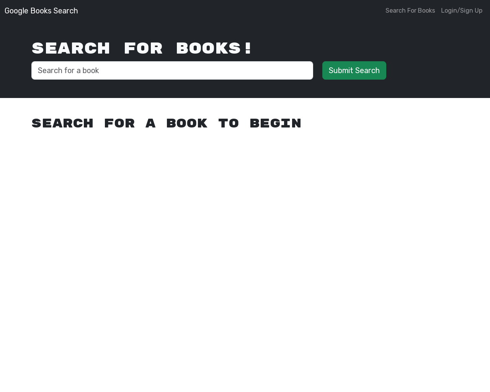

# GraphQL Conversion Search Engine 

## Description

Given a MERN build search engine, I was asked to refactor it to utilize a GraphQL database with an Apollo Server. This was done by replacing the api routes that came with the application with typeDefs and a resolver on the server side. On the client side, queries and mutations were added to use instead of the normal API routes.

## Table of Contents

1. [Usage](#usage)
2. [License](#license)
3. [Credits](#credits)
4. [Questions](#questions)
5. [Screenshot](#screenshot)

## Usage

This site's intended use is to look up books and add them to a personal storage after logging in. Additionally, this is a showcase for how to implement an Apollo Server into an application.

[Here](https://obscure-anchorage-38681-4b6af43cb591.herokuapp.com) is the deployed website for your convenience.

## License

This project is protected under the MIT license

## Credits

The starter code for this project was given by EdX for the CWRU Web Dev Coding Bootcamp. The necessary edits to convert it to an Apollo Server was done by me. Any additional assistance was given by my instructor, Ross Ritchey, and by utilizing the [Apollo Server Docs](https://www.apollographql.com/docs/apollo-server/).

## Questions

Q: What is your Github? A: My github is [GameCatCam](www.github.com/GameCatCam).

Q: What is your email? A: My email is cameronrawlins11@gmail.com.

## Screenshot

